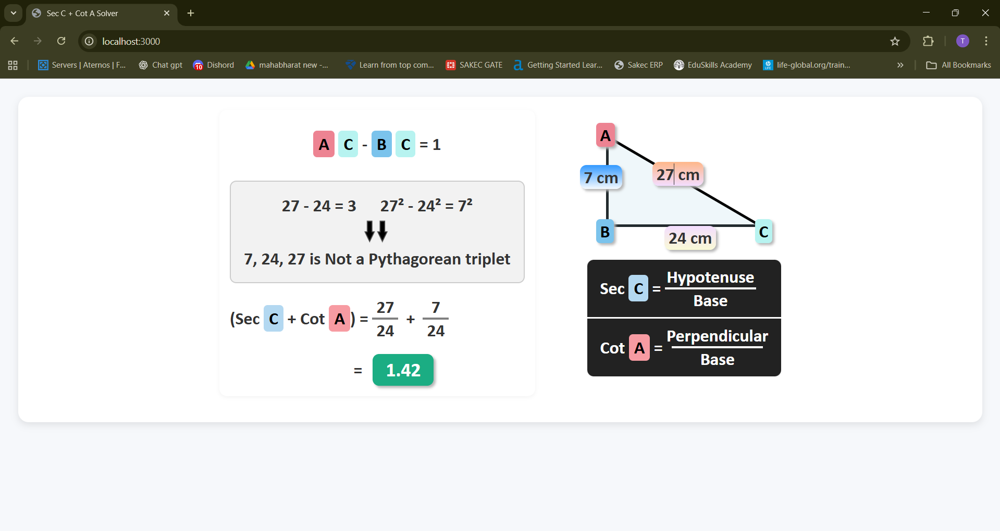
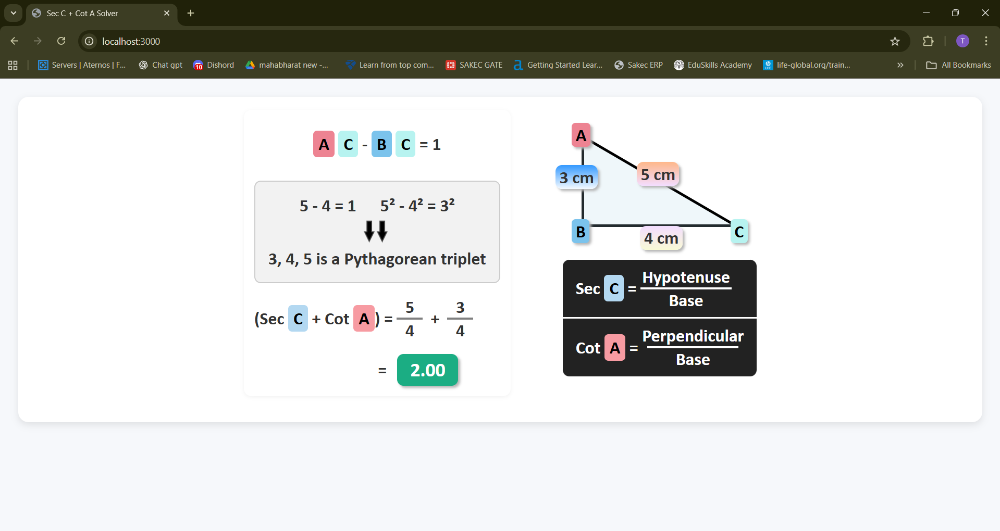

# 🟢 Pythagorean Triplet Solver App

## 📌 Problem Statement
This project solves a **trigonometry problem** using a Pythagorean triplet.  

**Question:**  

Check if the sides of a right triangle:  

- \(AB = 7\)  
- \(BC = 24\)  
- \(AC = 25\)  

form a Pythagorean triplet, and calculate:

- **Sec C** = Hypotenuse / Base  
- **Cot A** = Perpendicular / Base 

- **Template Used:** Template 1 – Trigonometry  
- The triangle diagram is **editable** (contenteditable fields), so users can update sides dynamically.

---

## ⚙️ How It Works

1. **Edit Triangle Sides:**  
   Users can click on the sides \(AB\), \(BC\), \(AC\) in the triangle diagram to change values directly.  

2. **Dynamic Updates:**  
   When any side is edited:
   - Pythagorean step updates automatically.  
   - Triplet verification text changes to reflect if it forms a Pythagorean triplet.  
   - Sec C + Cot A fraction and final result recalculate instantly.

3. **Backend Calculation:**  
   A **Node.js/Express server** handles:
   - Validating Pythagorean triplet
   - Calculating Sec C + Cot A  
   The frontend fetches the result from the server using `fetch()`.

---

## 🖼️ Output Screenshots

### 1️⃣ Editable Triangle Diagram
*Triangle sides can be changed directly: AB, BC, AC*

  

### 2️⃣ Calculated Steps and Result
*Dynamic Pythagorean step, triplet verification, and Sec + Cot result*

  

---

## 📝 Notes
- Only the **numbers and calculation steps** are replaced; **CSS and template structure are untouched**.  
- Fully **interactive**: changes in triangle sides update all dependent outputs dynamically.  
- Users can test different triangles to see triplet verification and Sec + Cot calculation instantly.
